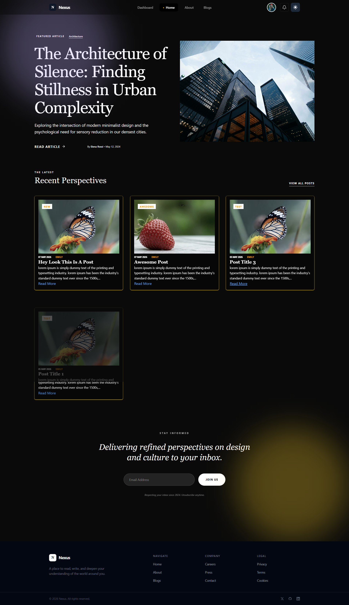
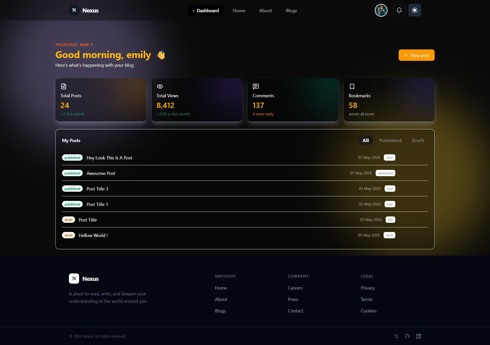
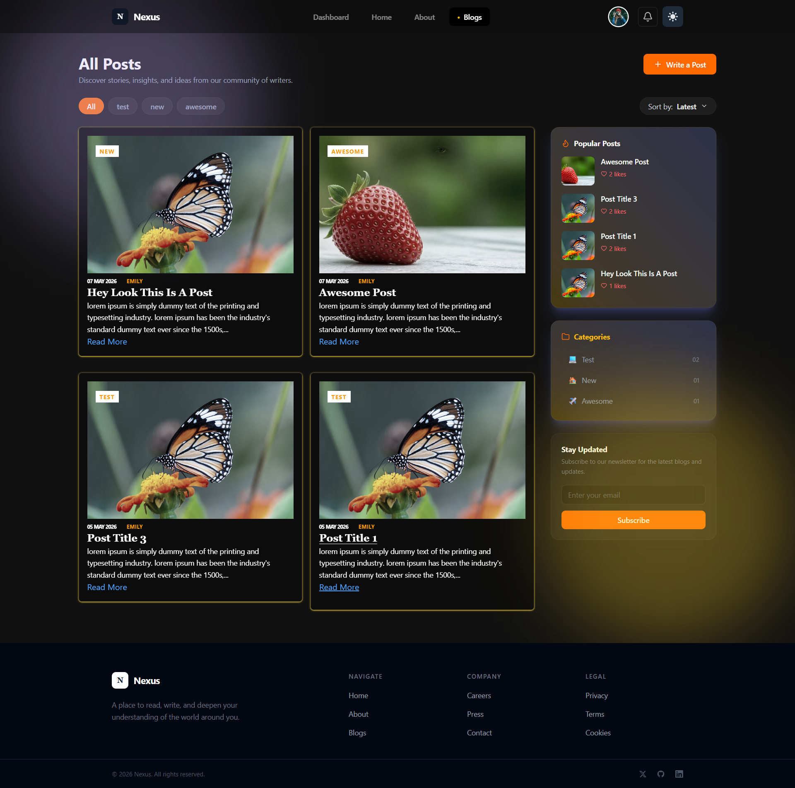

# Atoread

A modern full-stack blogging platform built with React, Node.js, Express, MongoDB, and Tailwind CSS.  
Atoread allows users to create, publish, draft, and interact with blogs through a clean and responsive user experience.

---

## ✨ Features

- 🔐 JWT Authentication & Authorization
- 📝 Create / Edit / Delete Blogs
- 📄 Draft & Publish Workflow
- ❤️ Like Posts System
- 📊 Dashboard Analytics
- 🖼️ Image Uploads with Cloudinary
- ⚡ Real-time Features with Socket.IO
- 🎞️ Smooth UI Animations using Motion
- 📱 Fully Responsive Design
- 🔎 Pagination & Recent Posts
- 🛡️ Protected & Guest Routes
- 🌙 Dark Mode UI
- 🚀 Optimized MongoDB Aggregation Pipelines

---

## 🚀 Tech Stack

### Frontend
- React 19
- React Router v7
- Redux Toolkit
- Context
- Tailwind CSS v4
- Motion
- Axios
- React Hook Form
- React Toastify
- Vite
- Socket.io

### Backend
- Node.js
- Express.js
- MongoDB
- Mongoose
- JWT Authentication
- Socket.IO
- Multer
- Cloudinary
- MongoDB Aggregation Pipelines

---

## 📸 Screenshots

### Home Page


### Dashboard


### Blog Page



---

## 📂 Folder Structure

```bash
frontend/atoread/
 ├── src/
    ├── components/
    ├── constant/
    ├── context/
    ├── hooks/
    ├── pages/
    ├── routes/
    ├── services/
    └── store/
backend/
 ├── src/
    ├── controllers/
    ├── db/
    ├── middlewares/
    ├── models/
    ├── routes/
    ├── utils/
    ├── app.js
    ├── constant.js
    └── index.js
```

---

## ⚙️ Installation

### Clone Repository

```bash
https://github.com/arslan15108/mern-blog.git
```

---

### Install Frontend Dependencies

```bash
cd frontend/atoread
npm install
```

---

### Install Backend Dependencies

```bash
cd backend
npm install
```

---

## 🔐 Environment Variables

Create a `.env` file inside the `server` directory.

```env
PORT=8000

MONGODB_URI=your_mongodb_uri

ACCESS_TOKEN_SECRET=your_access_secret
REFRESH_TOKEN_SECRET=your_refresh_secret

ACCESS_TOKEN_EXPIRY=1d
REFRESH_TOKEN_EXPIRY=7d

CLOUDINARY_CLOUD_NAME=your_cloud_name
CLOUDINARY_API_KEY=your_api_key
CLOUDINARY_API_SECRET=your_api_secret

CLIENT_URL=http://localhost:5173
```

---

## ▶️ Run Locally

### Frontend

```bash
cd client
npm run dev
```

---

### Backend

```bash
cd server
npm run dev
```

---

## 🌍 Deployment

Frontend: Vercel  
Backend: Render / Railway  
Database: MongoDB Atlas

---

## 🧠 Backend Highlights

### MongoDB Aggregation
- Recent Posts
- Pagination
- Like Counts
- User-specific Queries
- Dashboard Statistics

### Authentication
- Access & Refresh Tokens
- Protected Routes
- Guest Routes

### Media Handling
- Multer for File Uploads
- Cloudinary for Image Storage

### Real-time Features
- Socket.IO Integration
- Live Interactions Support

---

## 📌 Future Improvements

- 💬 Comments System
- 🔔 Real-time Notifications
- 📚 Bookmark Collections
- ✍️ Rich Text Editor
- 🤖 AI-assisted Writing
- 📈 Advanced Analytics
- 🏷️ Tags & Search Filters

---

## 👨‍💻 Author

Muhammad Arslan

---

## ⭐ Support

If you like this project, consider giving it a star ⭐ on GitHub.